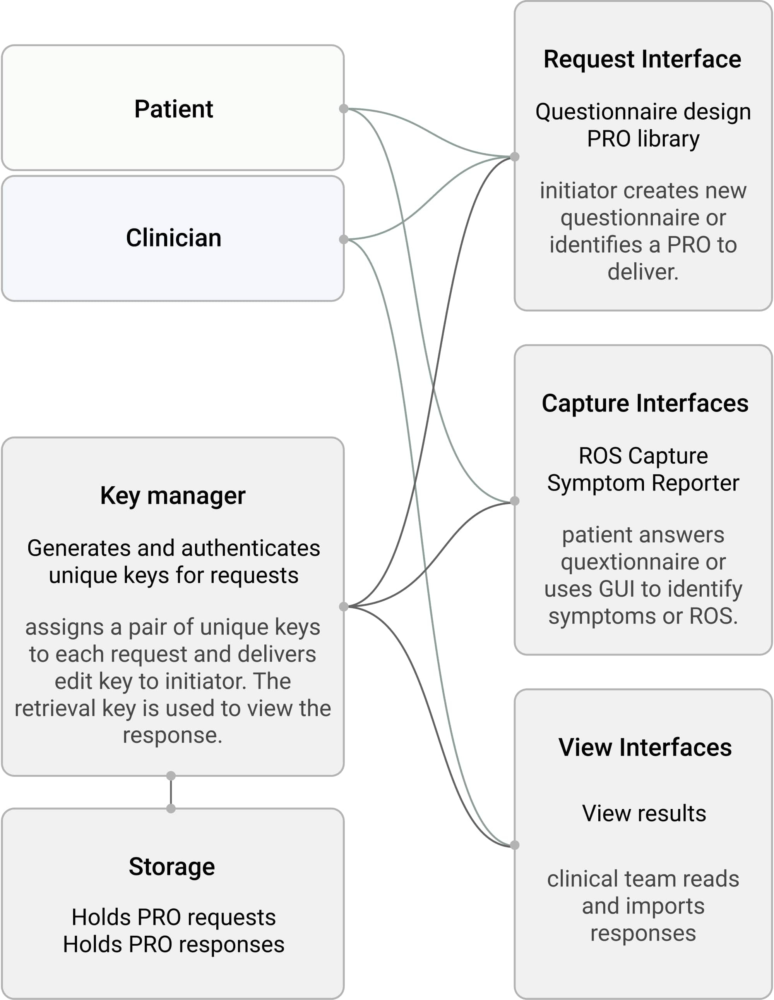

# openPRO Platform
The openPRO web service will offer low-effort administration of PROs for clinicians and patients. Any party can, ad hoc, initiate a PRO. The patient sends to the doctor via the service a de-identified PRO, which is assigned to the patient using separate established secure channels. The clinic can then insert the new data in the EHR, either by hand or by an import function implemented at the clinic’s side.

### Goals
- Empower patients to administer and initiate their own PROs and PROMs.
- Make administration and completion of PROs more convenient for both patients and administrative staff.
- Satisfy patient privacy by anonymizing the communication of the data. The data is then associated with the patient’s identity within the office’s established secure system.
- Provide a platform for distributing the Symptom Identifier, ROS reporter, and Voice PROMs.

### Components

- Front-end services:
 - Website for requesting, completing, and receiving PROs
 - Request interface
   - Request a PRO to be filled out by self or other
   - Receive a unique key that identifies the incomplete PRO
   - PRO/questionnaire is one of: custom designed questionnaire, established questionnaire from PROM library (PROMIS), openPRO product such as ROS capture or Symptom Reporter
 - Capture interface
  - User submits unique key to access and complete PRO
  - Provide interface to complete custom questionnaire
  - Provide interfaces from PROMIS or openPRO tools
 - View interface
   - User submits unique key to view or download completed PRO
   - Visualization tools for questionnaires, Symptom Reporter, and ROS Reporter.
   - Ability to produce associated FHIR Condition resources from questionnaires
- Back-end services:
  - Key manager. Generates, distributes, and processes keys associated with incomplete and complete PROs
  - Storage for pending and complete PROs.
- SMART on FHIR app that fetches the anonymous responses and attaches the patient’s identity to the PRO for insertion into EHR.

### Estimated Level of Effort
Design: 3 weeks, 1.0FTE
Development of minimal service: 6 weeks, 1.0FTE
